# [연구 계획서]
> ## 공공데이터 연계 AI 기반 뉴스 사실검증 시스템 PoC 개발
## 0. 프로젝트 개요
    AI 기반 시스템 PoC 개발
    - 뉴스 기사 내 수치 기반 주장 탐지 → KOSIS OpenAPI 기반 공식 통계와 비교 → 사실 여부 검증
    - 검증 가능한 주장 탐지 → 공식 통계 조회 → 비교 검증 → 설명 생성까지 수행하는 구조가 목표

---

## 1. Problem Definition (문제 정의)
### 1-1. 비즈니스 니즈 및 배경
* **문제 상황:** 뉴스 기사 등에서 `자의적인 해석`, `통계 기준(기간/모집단) 누락`, `과장된 수치 표현`, `왜곡된 통계 사용`, `맥락 없는 수치 인용`, `시점·단위 혼동`, `일부 데이터만 발췌` 등으로 인한 정보 왜곡이 지속적으로 발생
* **기존의 한계:** 현재는 기사 검색 및 공식 통계자료 확인을 통한 수작업 검증 비중이 높아 검증 누락 및 대응 지연 가능성이 존재
* **프로젝트 목표:** 뉴스 기사 내 '수치 기반 주장'을 자동으로 탐지하고, 공식 통계 API(KOSIS)와 대조하여 사실 여부를 판별(일치/불일치/판단불가)하며, 그 사유를 명확히 설명하는 시스템 PoC를 구축

### 1-2. Task Reformulation (문제를 AI Task로 재해석)
단순한 '가짜뉴스(True/False) 이진 분류'가 아닌, **숫자가 어떤 기준(시간, 모집단, 단위 등)으로 쓰였는지 추적하는 파이프라인(IE + Search + Deterministic Reasoning)** 으로 재정의한다.
1.  **IE (정보 추출):** 기사에서 검증 가능한 주장을 탐지하고 `[기간, 단위, 모집단 정의]` 등 핵심 정보를 추출
2.  **Retrieval (검색):** 추출된 파라미터로 KOSIS API 통계표 서치 및 매핑을 수행
3.  **Reasoning (연산 및 검증):** 표 데이터를 바탕으로 실제 수치 비교 및 검증을 수행하고, 불일치 유형 분석(수치/기간/모집단/과장 표현)을 거쳐 최종 설명을 생성

### 1-3. Task 설계
**End-to-End Statistical Fact-Checking & Confidence Scoring** - 뉴스 기사에서 `수치 주장 스키마`를 추출하고 키워드 검색한 KOSIS 전체 데이터와 대조하여 `최적 매칭 데이터, 진위 판정, 검증 신뢰도`를 도출하는 문제
- **하위 테스크:** 
    - **스키마 파싱(Schema Parsing):** AI 모델을 활용해 기사 내 주장을 기간, 단위, 모집단 등의 JSON 스키마로 구조화 (단, 출처나 기준이 모호한 정보는 `Null`로 처리)
    - **풀 스캔 검색 및 매칭 (Retrieval & Best Match):** KOSIS 키워드 검색으로 연관 통계표와 내부 데이터 전체를 불러온 뒤, 추출된 스키마와 대조하여 일치도가 가장 높은 최적의 데이터셋 탐색
    사실 검증 및 신뢰도 평가 (Verification & Scoring): 최적 매칭된 KOSIS 데이터와 기사의 실제 수치를 비교하고, 스키마의 `Null` 비율 및 다중 매칭 여부를 기반으로 최종 판정의 신뢰도를 계산
- **최종 산출물:** 수치 왜곡 판정 결과 및 **검증 신뢰도 리포트** (예: 판정 불일치/"기사 내 모집단 및 기준 연도 누락(*Null*)으로 여러 통계가 혼재되어 매칭되었으므로, 본 검증 결과의 신뢰도는 낮음")

### 1-4. 이 문제가 중요한 이유
- **불명확한 인용 관행 지적:** 언론 기사는 통계 기준을 의도적으로 누락하여 데이터를 왜곡하는 경우가 있다. 이 파이프라인은 단순히 수치의 참/거짓을 넘어, "기사가 얼마나 통계를 정확하게 인용했는가(Null 비율)"를 행동 가능한 인사이트로 바꾼다.

- **실제적인 자동화 가치:** KOSIS 표만 찾는 것이 아니라, 수많은 내부 데이터까지 전부 불러와 AI 스키마와 자동 대조(Best Match)하는 과정은 사람이 수작업으로 절대 할 수 없는 영역이다.

- **확장성:** 억측 기반의 할루시네이션(환각)을 방지하고 "기준이 모호해 검증이 어렵다"고 솔직하게 답변하는 시스템은 AI의 신뢰성을 크게 높이며, 추후 언론사별 데이터 인용 투명성 평가 지표 등으로 재사용될 수 있다.

---

## 2. Background & Baseline (조사 및 연구 과제)

### 2.1 Related Works
- **수치 및 시점 기반 검증 (Numerical & Temporal Fact Checking):**
    - 최근 CLEF CheckThat! 2026에서는 수치(Numerical) 및 시간(Temporal) 정보를 동시에 검증하고 그 추론 과정까지 생성하는 태스크를 요구한다.
    - 이는 "전년 동기 대비"와 같이 숨겨진 기준 시점이나 비교 대상 등의 맥락을 복원한 후 실제 통계와 비교해야 하는 높은 수준의 추론 능력을 필요로 한다.
        - [CLEF CheckThat! 2026 Task 2](https://checkthat.gitlab.io/clef2026/task2/)
        - [The CLEF 2026 CheckThat! Lab](https://arxiv.org/abs/2602.09516)
         

- **표 기반 사실 검증 (Tabular Fact Verification):**
    - 실제 공공데이터는 대부분 표(Table) 형태로 제공되기 때문에, 약 16,000개의 위키피디아 표를 바탕으로 한 TabFact 벤치마크가 널리 활용되고 있다.
    - 해당 연구는 심볼릭 추론, 수치 비교, 다중 홉(Multi-hop) 표 추론 능력을 요구한다.
        - [Tabular Fact Verification 논문](https://arxiv.org/abs/1909.02164)
        - [TabFact 공식](https://tabfact.github.io/about.html)
        - [TabFact GitHub](https://github.com/wenhuchen/Table-Fact-Checking)
         

- **LLM 한계 극복을 위한 표의 자연어 변환 (Table Verbalization):**
    - LLM은 정형 데이터의 행, 열, 수치 관계를 그대로 입력받을 경우 정확히 추론하지 못하는 한계가 지속적으로 보고되고 있다.
    - 이를 극복하기 위해 표를 자연어 문장으로 변환하여 LLM에 입력함으로써, Zero-shot 환경에서도 추론 정확도를 크게 향상시키는 TabV4FC 연구가 제안되었다.
        - [TabV4FC 논문](https://link.springer.com/article/10.1007/s41060-025-00998-3)
        - [TabV4FC GitHub](https://github.com/sonlam1102/tabv4fc)
         

- **도구 기반 에이전트 (Tool-Augmented Agent) 접근:**
    - 단순 프롬프팅만으로는 복잡한 계산이 어려워, LLM이 SQL, Python, 외부 API 등을 직접 호출하는 에이전트 구조가 새로운 흐름으로 자리 잡고 있다.
    - LLM이 필요한 계산을 외부 도구에 위임함으로써 복잡한 통계 계산에서 발생하는 환각(Hallucination) 현상을 크게 감소시키는 것으로 입증되었다.
        - [Tool-Augmented Agent 논문](https://arxiv.org/abs/2602.17937)
         

- **자연 논리 및 심볼릭 추론 (Symbolic Reasoning):**
    - 단순 신경망 대신 산술 함수와 논리적 추론을 결합하여, LLM이 생성한 산술 연산을 실제 표에서 실행하고 결과를 논리적으로 증명하는 TabVer 등의 방식이 높은 정확도를 기록하며 경쟁력을 입증하고 있다.
        - [Symbolic Reasoning과 Natural Logic 기반 추론 논문](https://arxiv.org/abs/2411.01093)
        - [MIT TACL](https://direct.mit.edu/tacl/article/doi/10.1162/tacl_a_00722/125986)

### 2.2 이번 프로젝트의 Baseline
- **Primary Baseline:** 기존 RAG 및 단순 프롬프팅 기반 검증 (Numerical & Temporal Reasoning)
    - 기사 텍스트를 기반으로 통계표를 검색한 후, 수치 비교와 시점 추론을 모두 LLM의 내부 연산에 의존하는 구조
    - **한계:** 계산 과정에서 환각(Hallucination)이 발생하며, 기사에 통계 기준이 누락되어 있을 경우 LLM이 숨겨진 맥락을 억지로 복원하려다 치명적인 오류를 범한다.
- **Secondary Baseline:** 기본형 도구 기반 에이전트 (Standard Tool-Augmented Agent)
    - LLM이 파이썬이나 API를 도구로 사용(호출)하여 연산의 정확도는 높인 구조
    - **한계:** 검색된 단일 통계표와 기사 주장을 1:1로 강제 매칭함. 언론어와 행정어(KOSIS) 간의 용어 불일치를 해결하는 '컨텍스트 정규화' 과정이 부재하여 국내 통계 환경(Domain) 적용에 한계가 있다.

⇒ **선정 이유:** 위 두 베이스라인은 현재 팩트체크 시스템들이 겪는 고질적인 문제(환각, 강제 추론, 도메인 불일치)를 대표합니다. 이를 바탕으로 본 프로젝트가 차세대 연구 방향(Tool-Augmented Agent + Schema Constraint + Meta-cognition)을 어떻게 실무적으로 구현했는지 명확히 대조할 수 있습니다.
    
---

## 3. Proposed Method
### 3.1 Architecture

```mermaid
flowchart LR
    crawler["크롤러"]
    noise["노이즈 제거"]
    parser["파서"]
    extract["핵심 데이터 추출"]
    normalize["정규화"]
    structure["뉴스 데이터 구조화"]

    crawler --> noise
    noise --> parser
    parser --> extract
    extract --> normalize
    normalize --> structure

    cache["뉴스 데이터 구조 캐싱"]
    schema["데이터 스키마<br/>null 개수 계산"]
    nullCheck{"null 개수가<br/>허용 기준을 초과하는가?"}

    structure --> cache
    cache --> schema
    schema --> nullCheck

    nullCheck -- "예: 구조화 재시도" --> structure

    subgraph sourceValidation["출처 일치 검증 및 데이터셋 탐색"]
        direction LR

        sourceQuery["쿼리 수정<br/>(LLM 심층 추론)"]
        sourceCode["코드 실행단 검증"]
        sourceKosis["KOSIS 통합 검색 API"]
        sourceJudge["LLM 판단<br/>(컨텍스트 격리)"]
        sourceRecheck["출처 정보 일치 재검증<br/>(규칙 기반)"]

        sourceQuery --> sourceCode
        sourceCode --> sourceKosis
        sourceKosis --> sourceJudge
        sourceJudge --> sourceRecheck
        sourceJudge -- "재탐색 필요" --> sourceQuery
    end

    nullCheck -- "아니오: 검증 진행" --> sourceQuery

    subgraph numericValidation["쿼리 탐색 및 수치 정보 검증"]
        direction LR

        numericQuery["쿼리 수정<br/>(심층 추론)"]
        numericCode["코드 실행단 검증"]
        numericKosis["KOSIS 통합 검색 API"]
        numericJudge["LLM 판단<br/>(컨텍스트 격리)"]
        numericRecheck["수치 정보 일치 재검증<br/>(규칙 기반)"]

        numericQuery --> numericCode
        numericCode --> numericKosis
        numericKosis --> numericJudge
        numericJudge --> numericRecheck
        numericJudge -- "재탐색 필요" --> numericQuery
    end

    sourceRecheck --> numericQuery

    cache -. "구조화된 뉴스 데이터" .-> sourceRecheck
    cache -. "구조화된 뉴스 데이터" .-> numericRecheck
```

### 3.2 Baseline 대비 무엇이 다른가
| 구분 | Baseline (기존 Agent 및 RAG) | Proposed Method (이번 프로젝트) |
|---|---|---|
|대조 데이터 탐색 방식|상위에 검색된 단일 통계표에 기사 내용을 1:1로 강제 매칭 시도|유지보수가 불필요하도록, **통합검색 API로 획득한 전체 후보 데이터를 스캔하여 최적 대조군(Best Match) 동적 탐색**|
|맥락 누락(Null) 대응|기준이 누락되어도 LLM이 숨겨진 맥락을 억지로 복원하여 진위 강제 판정|스키마의 Null을 명시적으로 인지하고, 다중 매칭 시 **'검증 신뢰도 하락'** 으로 판정하는 메타 인지 수행|
|연산 및 추론 주체|LLM 내부 연산에 전적으로 의존하거나, 제한적인 도구 사용으로 환각 노출|스키마 파싱을 통한 명확한 기준 마련 후, **최종 대조 방식(룰 기반 하드코딩 vs LLM 추론)은 실험을 통해 최적화**하여 환각을 통제|
|**최종 산출물**|True / False 기반의 1차원적 이진 분류 결과|판정 결과 + 불명확한 통계 인용 관행을 지적하는 **검증 신뢰도(Confidence Score) 리포트**|

### 3.3 Database & Preprocessing
- **사용 데이터셋:**
    - (자체 구축 벤치마크) **2025년 조선일보 기사 데이터셋 (약 2,500건 이상)** - 실제 언론 보도 환경을 반영한 검증용 데이터셋
    - (외부 지식 베이스) **KOSIS OpenAPI 데이터베이스** — 통계청 및 공공기관의 공식 메타데이터 및 실제 통계 수치
- **데이터 특성:**
    - 라벨: 기사 메타정보(제목, 작성일, URL, 본문) 및 **검색 구분(증명 가능 데이터 유무 True/False)**
    - 기사 본문이 길고, 전체 문맥 중 검증이 필요한 수치 기반 주장이 국소적으로 산재해 있음
    - 언론 특유의 과장된 수치 표현이 잦으며, 통계 기준(기간, 모집단 등)을 의도적으로 누락한 **암묵적 누락(Null 파라미터) 사례가 다수 존재**
- **전처리:**
    - **문장 토큰화 및 필터링:** 기사 전체 본문에서 수치가 포함된 핵심 주장 문장만 추출(Filtering)하여 연산량 및 데이터 파일 크기 최적화
    - **정형 스키마(Schema) 변환:** 추출된 문장을 AI 모델을 통해 `(검색 키워드, 기간, 모집단, 단위, 검증 대상 수치)` 형태의 JSON 규격으로 파싱
    - **결측치(Null) 태깅 및 검색어 정제:** 기사 내에서 명확히 언급되지 않은 통계 기준(예: 특정 연령대, 기준 연도 등)은 억지로 추론하지 않고 명시적인 Null 값으로 마스킹(Masking) 처리. 동시에 KOSIS 통합검색 API의 탐색 효율을 높이기 위해 핵심 검색어(Search Keyword)를 정제

### 3.4 왜 효과가 있을 것으로 예상하는가 (검증 대상 가설)
- **H1 (Dynamic Best Match의 효과):** 단일 통계표에 의존하는 기존 검색(RAG) 방식과 달리, KOSIS 통합검색으로 광범위한 후보 데이터를 불러온 뒤 정형 스키마와 대조하여 찾아내는 Best Match 방식은 복잡한 매핑 사전 구축 없이도 증거 탐색의 정밀도(Retrieval Precision)와 시스템의 유지보수성을 대폭 향상시킬 것이다.
- **H2 (Meta-cognition의 효과):** 기준이 누락된 기사(Null 스키마)에 대해 억지로 참/거짓을 도출하지 않고 '검증 신뢰도 하락'으로 평가하는 메타 인지 로직은, 억지 추론으로 인한 치명적 오류(False Positive/Negative)를 방지하여 시스템의 실제 서비스 도입 가능성을 높일 것이다.
- **H3 (검증 방식에 따른 환각 통제 효과):** 최종 수치 대조 시, 엄격한 룰 기반(Hard-coding) 연산이 환각을 원천 차단하는 데 더 효과적일지, 혹은 LLM 추론이 기사의 복잡한 문맥을 반영하여 더 높은 재현율(Recall)을 보일 것인지 통제된 비교 실험을 통해 팩트체크 엔진의 최적 모델을 도출할 수 있을 것이다.

---

## 4. Experiment Design
> 본 프로젝트의 핵심인 뉴스 사실 검증 및 말장난 필터링 성능을 극대화하기 위해, [뉴스 입력 전처리 방식]과 [KOSIS 통계 데이터 리트리벌(Retrieval) 범위]를 독립 변수로 설정하여 다각도의 비교 실험을 수행한다.

### 4.1 검증 대상 가설 (Hypotheses)
- **[실험 축 1] 뉴스 입력 전처리 방식이 검증 정확도에 미치는 영향**
    - **가설 1-A (기사 원문 전체 입력 방식):** 뉴스 기사 원문 전체를 LLM의 컨텍스트에 그대로 입력하는 방식은 맥락을 풍부하게 제공할 수 있으나, 문장 내 노이즈와 부가 정보로 인해 수치 주장(Claim) 추출의 정밀도가 떨어지며 할루시네이션 및 토큰 낭비를 유발할 것이다.
    - **가설 1-B (JSON 스키마 전처리 입력 방식):** 기사 원문을 사전에 파싱하여 [기준 시점, 대상 모집단, 핵심 지표, 비교 수치] 형태의 **JSON 구조로 정제하여 입력하는 방식**은 LLM에게 명확한 제약 조건(Schema Constraint)을 부여함으로써, "주어를 생략하거나 구형 비교군을 사용하는 말장난"을 원천 차단하고 판정 정확도를 향상시킬 것이다.
- **[실험 축 2] KOSIS 통계 데이터 검색 범위가 연산 오류에 미치는 영향**
    - **가설 2-A (테이블별 타겟 검색 방식):** 뉴스 키워드를 기반으로 KOSIS의 개별 통계표(Table)를 1차 매핑한 후, 해당 테이블 내부의 타겟 데이터만 파싱하여 전달하는 방식은 데이터의 노이즈를 최소화하고 수학적 연산(Pandas 툴 바인딩)의 정밀도를 높여 연산 오류를 줄일 것이다.
    - **가설 2-B (전체 데이터 덤프 로드 방식):** 키워드와 연관된 검색 결과 내의 모든 통계 데이터를 가공 없이 통째로 가져와 LLM에게 판단을 맡기는 방식은, 데이터 누락은 방지할 수 있으나 정보 과다(Information Overload)로 인해 엉뚱한 기준년도나 행/열을 참조하는 에러율을 높일 것이다.

### 4.2 독립 변수 및 실험 통제 매트릭스 (2 x 2 Factorial Design)
두 가지 실험 축을 교차 구성하여 총 4개의 대조군 및 실험군 그룹을 형성하고 성능을 비교 분석한다.

| 실험 그룹 | 뉴스 전처리 방식 (Input) | KOSIS 데이터 조회 방식 (Retrieval) |
|---|---|---|
| Group 1 (하한선) | 기사 원문 전체 (Raw Text) | 키워드 매칭 관련 전체 데이터 로드 |
| Group 2 | 기사 원문 전체 (Raw Text) | 테이블별 타겟 검색 후 부분 추출 |
| Group 3 | <mark> JSON 스키마 정제 변환 </mark> | <mark> 키워드 매칭 관련 전체 데이터 로드 </mark> |
| Group 4 (제안 방법) | JSON 스키마 정제 변환 | 테이블별 타겟 검색 후 부분 추출 |

### 4.3 Evaluation Metrics (성능 평가 지표)
1. **추출 정밀도 (Information Extraction Metric):** 뉴스 기사 내에서 검증이 필요한 핵심 조건과 주장 수치를 누락 없이 정형화했는지 여부를 `Exact Match F1-Score`로 평가한다.
2. **매핑 정확도 (Mapping Accuracy):** 기사가 악의적으로 왜곡한 비교군(예: 구형 그래픽카드 대조 등)에 속지 않고, 올바른 KOSIS 통계표 고유 ID 및 최신 메타데이터를 매핑했는지 매칭 정확도를 측정한다.
3. **최종 판정 지표 (End-to-End Pair F1):** 최종 단계에서 [일치 / 불일치 / 판단불가] 및 불일치 유형(모집단 왜곡, 시점 왜곡 등)을 정확하게 분류했는지 `Macro-F1` 및 복합 `Pair-level F1-Score`로 최종 검증한다.

### 4.4 검증 방법 및 Sanity Check
- **통계적 신뢰성 확보:** 데이터셋 내 임의의 샘플 100건 이상을 대상으로 각 그룹별 실험을 3회 이상 반복 수행(Random Seed 변경)하여 평균 및 표준편차를 기록한다.
- **비즈니스 Sanity Check:** AI 에이전트가 통계 테이블별 타겟 검색(Group 4)을 통해 도출한 최종 사실 검증 결과 보고서가, 도메인 전문가(사람 검증자)가 직접 수작업으로 대조한 정성적 분석 결과와 일치하는지 정합성을 최종 검증한다.

---

## 5. Timeline (6주 종합 계획)

| 주차 | 단계 (멋사 커리큘럼) | 세부 수행 내용 | 주요 산출물 |
| :--- | :--- | :--- | :--- |
| **1주차** | 실전 1 | 기사 데이터 100건 EDA, KOSIS 통계표 관찰, 추출용 JSON 스키마 정의 및 **골드 데이터 30건 구축** | EDA 리포트, 스키마 정의서, 골드셋 일부 |
| **2주차** | 실전 2 | KOSIS API 파이썬 호출(래퍼) 및 표 연산 모듈(코드 기반) 구축 | API 호출 툴, 연산 로직 |
| **3주차** | 종합 1 (검색 고도화) | 임베딩 v2 + 리랭커 모델 결합 하이브리드 파이프라인 구축 및 정확도 테스트 | 하이브리드 검색 모듈 |
| **4주차** | 종합 2 (추출 및 연결) | HCX-007 기반 주장 추출 및 검색/연산 모듈(Agent) 간 파이프라인 통합 | 통합 시스템 초안 |
| **5주차** | 종합 3 (판정 및 설명) | Python 계산 결과와 기사 대조(일치/불일치/판단불가 규칙 적용), 설명 생성 프롬프트 고도화 | 판정 및 설명 엔진 |
| **6주차** | 종합 4 (평가 및 보완) | 전체 골드 데이터(50~100건) 기반 정량/정성 평가, 실패 케이스 분석, 최종 리포트 작성 | 최종 PoC 서비스/API, 평가 결과 |